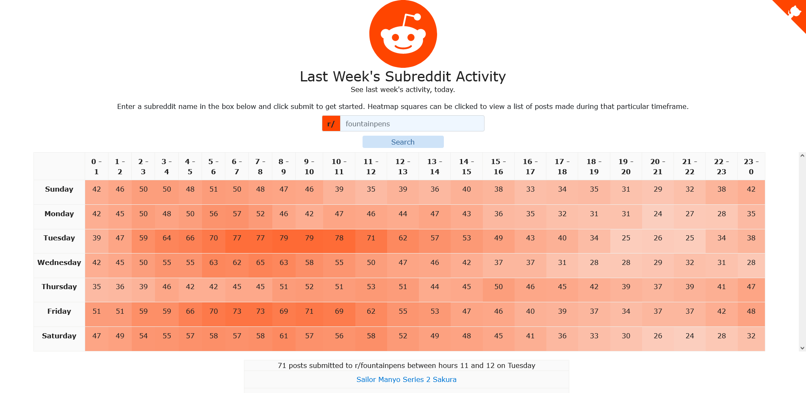
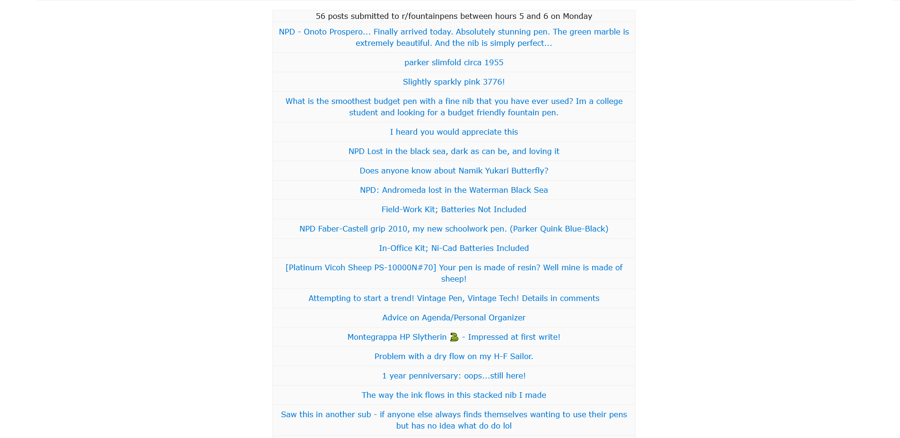
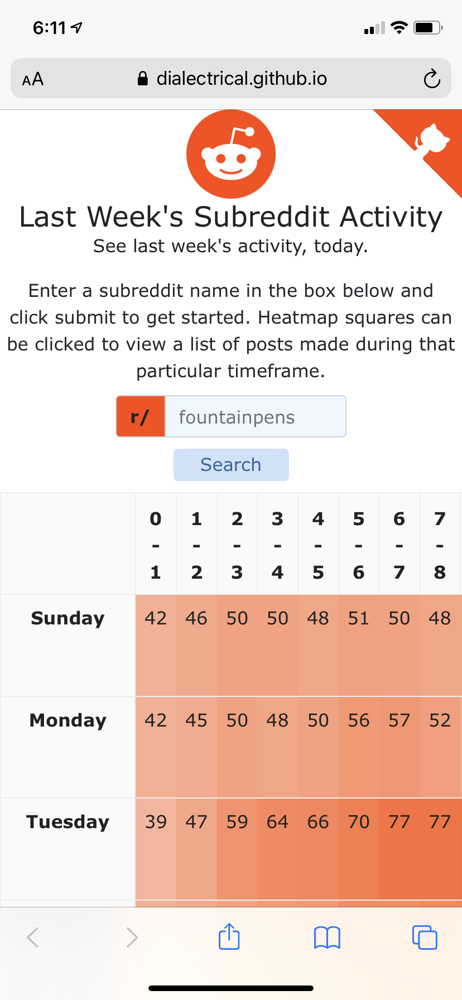
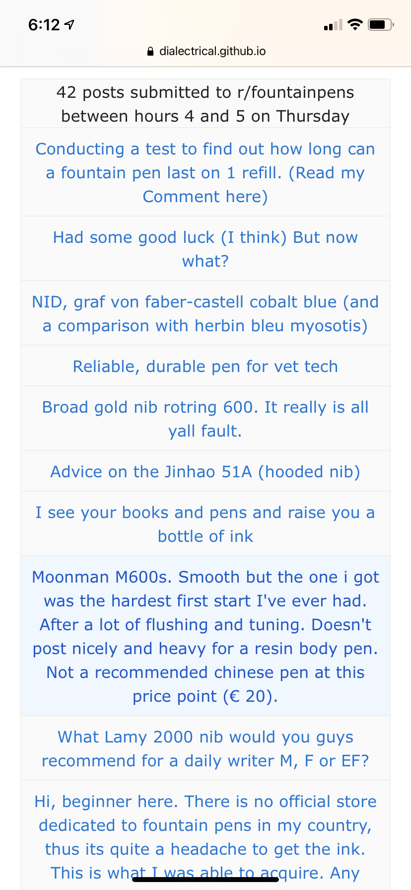

# Reddit analytics

Displays a heatmap of posts submitted to a given subreddit along with a list of posts made each hour. Uses [pushshift's api](https://github.com/pushshift/api) to gather data from Reddit *and currently takes about 3 to 5 mintues to complete a request in order to reliably avoid exceeding the API's rate limit*. The API's rate limit is not something I control, sadly, and until I am able to create my own Reddit scraper, the load time is subject to whatever rate limit pushshift decides to implement. 

Built with React.

Check out the [demo](https://dialectrical.github.io/reddit-analytics/).

## Screenshots

### Desktop

Users can input a subreddit to generate a heatmap from:

Users can also view the posts made each hour:

Clicking a link takes users to the corresponding Reddit post!

### Mobile

On mobile, the heatmap is resized and given an overflow scroll bar to keep things tidy:

And users can still access hourly post lists:

## Contributing

### Getting started

Clone this repo, run `npm install` and `npm start` and you're good to go.

### Submitting an issue

Feel free to submit an issue for any bugs, feature requests, or fixes. Be as clear and concise as possible when describing the issue and what you'd like to see changed.

### Submitting a pull request

Link your PR to any related issues and describe what your PR changes.
